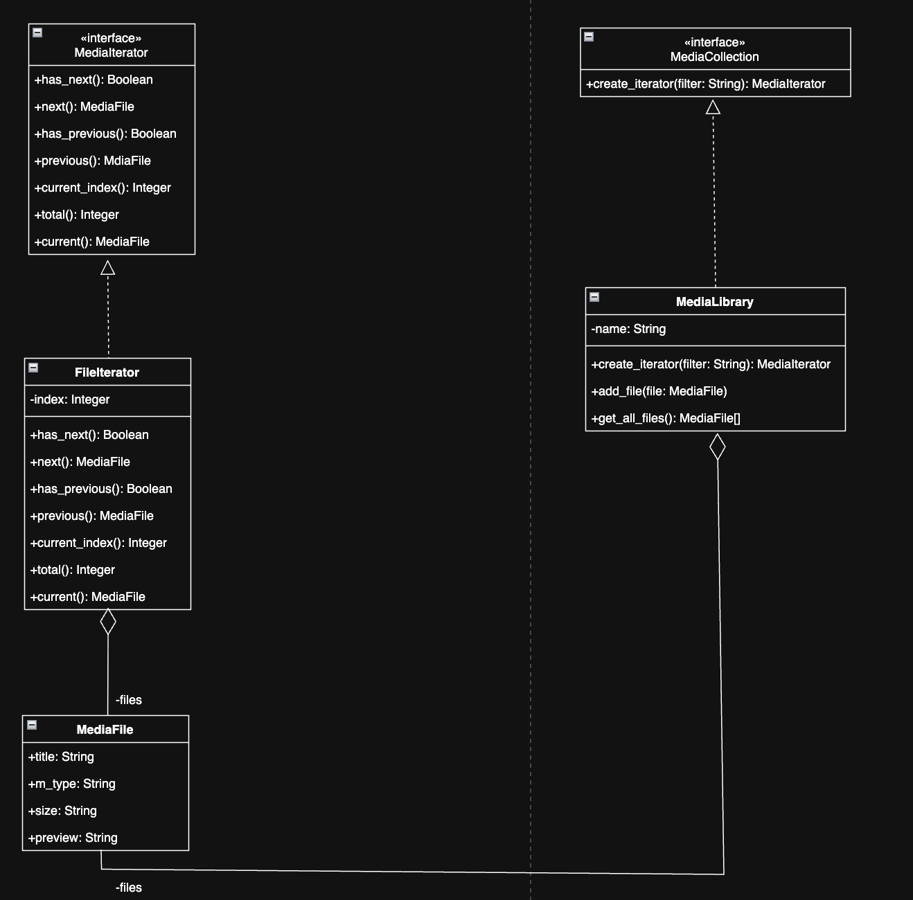

# Лабораторная работа №3 — Паттерн Iterator

## Предметная область: Медиа галерея

### 1. Описание проблемы
Проблема: Управление навигацией в медиа-коллекции
При разработке медиа-галереи возникает ряд сложностей: сложность логики навигации, проблема филтрации, нарушение инкапсуляции

### 2. Решение: паттерн Iterator

Паттерн Iterator выносит логику обхода коллекции в отдельный объект — итератор. Итератор инкапсулирует свой способ навигации и хранит собственное состояние (текущую позицию).

#### Структура проекта

Определён интерфейс `MediaIterator` с методами:
- `has_next(): Boolean` — есть ли следующий файл
- `next()` — перейти к следующему
- `has_previous(): Boolean` — есть ли предыдущий файл
- `previous(): MediaFile` — перейти к предыдущему
- `current_index(): Integer` — текущий индекс
- `total(): Integer` — общее количество файлов
- `current(): MediaFile` — получить текущий файл

Три конкретных итератора реализуют этот интерфейс:

| Итератор | Поведение |
|---|---|
| `FileIterator` | Обход  фильтруя по типу файла |

### 3. Диаграмма классов

### 4. Вывод

Внедрение паттерна Iterator повлияло на проект следующим образом:

**Разделение ответственностей.** Класс `MediaLibrary` отвечает только за хранение и дабавление файлов. Логика навигации и фильтрации полностью вынесена в итераторы.

**Расширяемость.** 

**Единый интерфейс.** Благодаря абстрактному интерфейсу `MediaIterator` клиентский код (GUI, API) работает одинаково с любым итератором. 
